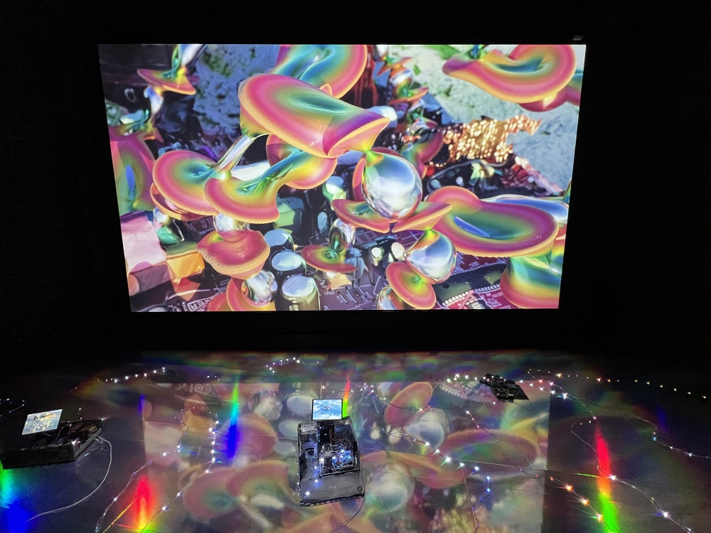
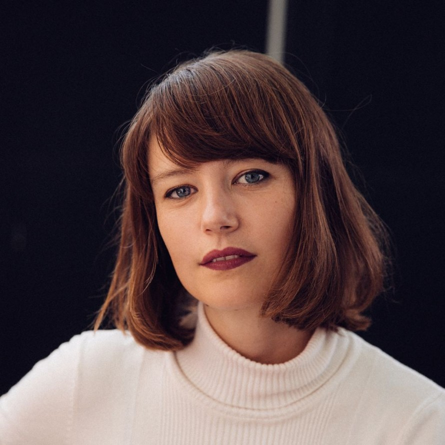
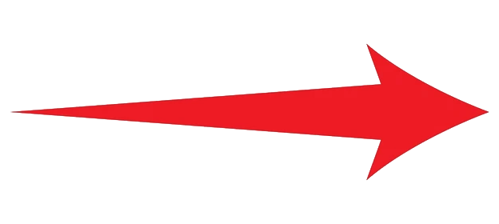

# Inflorescence

## Responsables
### Réalisé par: Sabrina Ratté

### Conception sonore fait par: Roger Tellier Craig

### Integration multimédia fait par: Guillaume Arseneault

## Dates
- Création: Début 2023
- Première Présentation: 1er Juin 2023 au 6 Août 2023

## Lieux
- Chez *Arsenal Contemporary Arts*, Futurs Spéculaire, à **Montréal**, en 2023
- Chez *Zollverein UNESCO World Heritage Site*, New Now Festival, en **Allemagne**, en 2023
- Chez *Fotografiska*, en **Shanghai**, en 2024

## Description d'Inflorescence
Inflorescence est une oeuvre qui représente des déchêts du futur, dans cette oeuvre, des ordinateurs, qui sont utilisés comme maison par la vie végétale et fongique. De plus, le thème de déchêt provenant de l'humain est amplifié par l'endroit où l'oeuvre est exposée, dans un conteneur. Les ordinateurs, encerclés de lumières colorés, ont des écrans qui visualise la vie végétale et fongique qui se construit et s'étend sur l'ordinateur dans ce monde vacant de vie humaine. L'atmosphère est vécue par des haut-parleurs, jouant des sons mystérieux, dans ce futur déserté. Le public visé est tout le monde. N'importe quel âge peut apprécier Inflorescence.

## Fonctionnement 
La composante centrale de cette oeuvre est les écrans HDMI qui affiche les animations 3D de la vie végétale et fongale qui habite une autre composante vitale de cette oeuvre, les ordinateurs recyclés. Sans les écrans, Inflorescence ne serait que des ordinateurs recyclés avec des lumières colorés et une piste audio atmosphérique, mais les écrans amène une histoire, un thème visuel qui définit l'oeuvre.

## Avis Personnel
J'aime beaucoup l'environnement où l'oeuvre est exposée, un conteneur. C'est unique et rafraichissant à voir. De plus, l'oeuvre nous amènent à faire sur réflection sur le futur et nos mauvaises façons de disposer ses ordures, ce qui m'intéresse. En général, les installations avec aucune interactivité m'endort, mais celle si était si différente que ça m'a inspiré à ne pas juste penser à propos de l'oeuvre quand j'en conceptualise une, mais également à son environnement. Un autre aspect visuel que j'ai trouvé cool était comment l'installation avait l'air d'être sous l'eau, dans le sens que les ordinateurs donnait l'impression d'être habité par de la vie marine au fond de l'océan et les lumières, comme des coraux colorés, venaient ajouter à ce thème. Le conteneur aidait à jouer avec cette histoire, comme si conteneur sur un bateau avec du cargo est tombé dans l'océan, où il y a plusieurs milliers de tonnes de déchêts humains. Le conteneur qui transportait des ordinateurs tombe au fond de l'océan et devient la maison de des espèces marines. Malheureusement pour moi, cette histoire qui amène de l'attention à propos de la pollution marine, comment ça se produit et ce qui arrive à ces déchêts n'était que mon interprétation et non ce qui est représenté. C'est supposé représenté un futur après l'humain où la vie végétale et fongale se sont mit à vivre où les humains précédamment étaient, ce qui réduit beaucoup pour moi mon appréciation de l'oeuvre.
